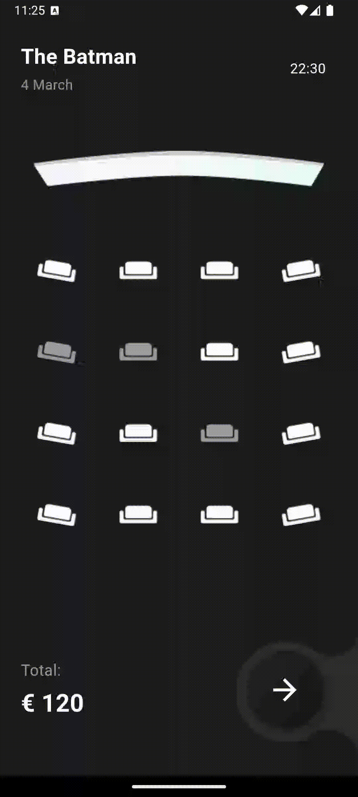
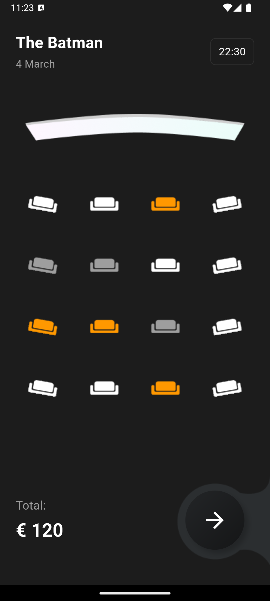
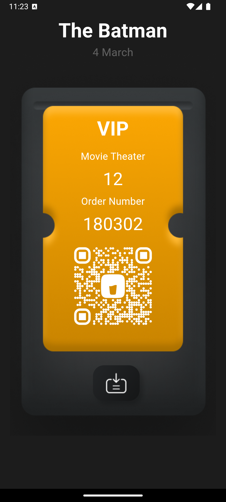

---

# 🎟️ Cinema Ticket App (Flutter UI)

A Flutter project that replicates the Cinema Ticket Mobile App UI, designed in Figma. This app is perfect for learning Flutter layout structures, and animations while creating a visually engaging ticket booking experience.

  
  

This project is an **UI** of the Cinema Ticket Mobile App Figma design, available [here](https://www.figma.com/community/file/1085119917481591329/cinema-ticket-mobile-app). It demonstrates a modern, interactive, and clean user interface for a cinema seat selection and ticket booking application.

---

## 🙏 Acknowledgments

- **Figma Design**: Thanks to the original designer of the [Cinema Ticket Mobile App UI](https://www.figma.com/community/file/1085119917481591329/cinema-ticket-mobile-app), [@alpoguzkarasu](https://www.figma.com/@alpoguzkarasu).
- **Flutter Community**: For continuous support and inspiration.

---

### 📬 Contact

Feel free to reach out if you have any questions or suggestions!

- **Author**: [M Khoirul Wafa](https://github.com/mkhoirulwafa18)
- **Project Repository**: [Cinema Ticket App](https://github.com/mkhoirulwafa18/cinema_ticket_app)

---